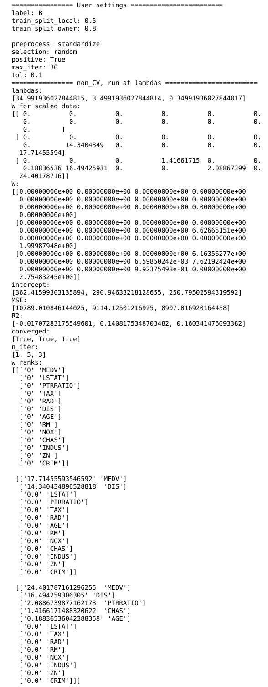

# coinstac-lasso-csv
COINSTAC implementation for decentralized multi-shot Lasso regression for generic CSV files.

Run a testing case: `./run.sh`

### 1. Overview
Linear model: 

    y = wx + w0.
l1-regularized optimization objective:

    (1 / (2 * n_samples)) * ||y - Xw||^2_2 + lambda * ||w||_1. 

Optimization algorithm:
    coordinate descent (shooting algorithm) [[1], [2]](#2).

This implementation provides two functionalities:

    1. Pick the best l1-regularizer lambda by cross validation (CV) and then train & test at that lambda.
        The best lambda is the one generating the smallest mean squared errors (MSE) averaged over the folds.
        Sample output:
       

    2. Train & test at a list of lambdas.   
        The regularization path along the list of lambdas can be obtained.
        Sample output:

### 2. Input
label: any label in the CSV files. 

### 3. Code
The following diagram shows the framework implemented in [local.py](scripts/local.py) and [remote.py](scripts/remote.py).

### References
<a id="1">[1]</a> 
 K.  Chaudhuri,  C.  Monteleoni,  and  A.  D.  Sarwate,  “Differentially  privateempirical risk minimization,” Journal of Machine Learning Research, vol. 12,no. Mar, pp. 1069–1109, 2011.

<a id="2">[2]</a> 
 ——, “Documentation for regularized lr and regularized svm code,” Available at http://cseweb.ucsd.edu/kamalika/code/dperm/documentation.pdf. 
